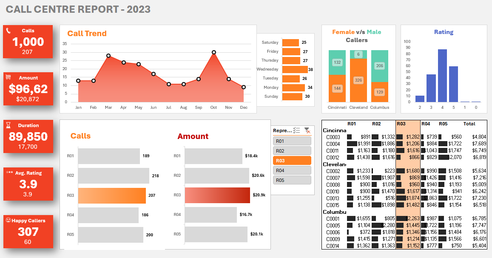

# 📞 Call Centre Analytics | Excel Data Analytics Project

> **Tools Used:** Excel • Pivot Tables • Pivot Charts • Excel Formulas

## 📌 Project Overview

This project presents an Excel-based data analytics solution for analyzing call centre operations. The objective was to transform raw call and customer data into meaningful business insights using data cleaning, Excel formulas, pivot tables, pivot charts, and an interactive dashboard.

The project analyzes call volume, representative performance, purchase amounts, customer satisfaction ratings, call duration, customer demographics, and city-level patterns to support data-driven decision-making.

---

## 🎯 Business Objectives

- Analyze overall call centre performance.
- Evaluate representative performance based on call volume and purchase amount.
- Identify trends in call activity across different months and days of the week.
- Analyze customer satisfaction and rating patterns.
- Understand call distribution across different cities and genders.
- Build an interactive Excel dashboard to support business decisions.

---

## 🛠️ Tools & Technologies

| Tool / Technology | Purpose |
|-------------------|---------|
| **Microsoft Excel** | Data cleaning, preprocessing, analysis, and dashboard development |
| **Excel Formulas** | Creating calculated fields such as financial year, day of week, duration buckets, and rounded ratings |
| **Pivot Tables** | Summarizing call centre data and calculating key performance indicators |
| **Pivot Charts** | Visualizing call trends, representative performance, customer demographics, and ratings |
| **Excel Dashboard** | Interactive reporting and business performance analysis |

---

## 📂 Project Workflow

```text
Raw Data
    ↓
Excel Cleaning & Preparation
    ↓
Excel Formulas
    ↓
Pivot Tables
    ↓
Pivot Charts
    ↓
Interactive Dashboard
    ↓
Business Insights & Recommendations
```

---

## 📊 Dashboard Preview

> The Excel dashboard provides an interactive view of call centre performance, representative activity, customer demographics, call trends, and satisfaction ratings.

### 📄 Call Centre Report



---

## 📊 Key Insights & Recommendations

### 📊 Insight 1: The Call Centre Handled 1,000 Calls

**Insight:**
The dataset contains 1,000 call records with a total purchase amount of $96,623. The average customer satisfaction rating was 3.89, with 307 calls receiving a 5-star rating.

**💡 Recommendation:**
Continue monitoring overall call volume, purchase amount, and customer satisfaction together to understand both operational performance and customer experience.

---

### 📊 Insight 2: R02 Handled the Highest Number of Calls

**Insight:**
Representative R02 handled the highest number of calls with 218 calls, followed by R03 with 207 calls.

**💡 Recommendation:**
Review R02's workload and performance to understand how the representative is managing the highest call volume. Similar working practices can be shared with other representatives where appropriate.

---

### 📊 Insight 3: R03 Generated the Highest Purchase Amount

**Insight:**
Representative R03 generated the highest purchase amount of $20,872 among all representatives.

**💡 Recommendation:**
Analyze the factors contributing to R03's strong purchase performance and identify practices that could help other representatives improve their results.

---

### 📊 Insight 4: October Had the Highest Call Volume for R03

**Insight:**
For the selected representative R03, October recorded the highest monthly call volume with 30 calls.

**💡 Recommendation:**
Monitor periods with higher call activity and ensure representatives have sufficient capacity to handle increased workloads while maintaining customer service quality.

---

### 📊 Insight 5: Wednesday Had the Highest Call Volume for R03

**Insight:**
For the selected representative R03, Wednesday recorded the highest number of calls with 38 calls.

**💡 Recommendation:**
Use day-level call patterns to plan workloads and schedules more effectively, especially during days with higher call activity.

---

### 📊 Insight 6: Cleveland Had the Highest Number of Calls

**Insight:**
Cleveland recorded the highest number of calls with 389 calls, followed by Columbus with 335 and Cincinnati with 276 calls. Overall, female customers accounted for 599 calls while male customers accounted for 401 calls.

**💡 Recommendation:**
Focus on understanding customer behaviour in high-volume cities such as Cleveland and consider demographic patterns when planning customer service strategies.

---

### 📊 Insight 7: R03 Had a Higher Concentration of 4-Star Ratings

**Insight:**
For the selected representative R03, 88 calls received a 4-star rating and 60 calls received a 5-star rating. This indicates that most rated calls were concentrated around the higher satisfaction levels.

**💡 Recommendation:**
Identify the factors behind the strong customer satisfaction levels and focus on converting more 4-star experiences into 5-star experiences.

**Note:** These insights and recommendations are based on the analysis of the provided call centre dataset and are intended to demonstrate data-driven decision-making.

---

## 📁 Repository Structure

```text
Call-Centre-Analytics/
│
├── Call Centre Report.xlsx
│
├── images/
│   └── Call_Centre_Report.png
│
└── README.md
```

---

## 💼 Skills Demonstrated

- Data Cleaning & Preparation
- Excel Data Analysis
- Excel Formulas
- Pivot Tables
- Pivot Charts
- Interactive Dashboard Development
- KPI Analysis
- Business Insight Generation
- Data Visualization
- Data Storytelling
- Problem Solving

---

## 📝 Conclusion

This project demonstrates an Excel-based data analytics workflow, starting from raw call centre and customer data and progressing through data preparation, formula-based calculations, pivot table analysis, visualization, and interactive dashboard development.

By combining Excel formulas, pivot tables, pivot charts, and dashboard design, the project transforms raw call centre data into meaningful business insights. The analysis highlights representative performance, call trends, purchase amounts, customer satisfaction, and demographic patterns while providing actionable recommendations.

Overall, this project showcases practical Excel data analytics skills, business problem-solving, and the ability to communicate insights through effective visualizations and dashboard storytelling.
